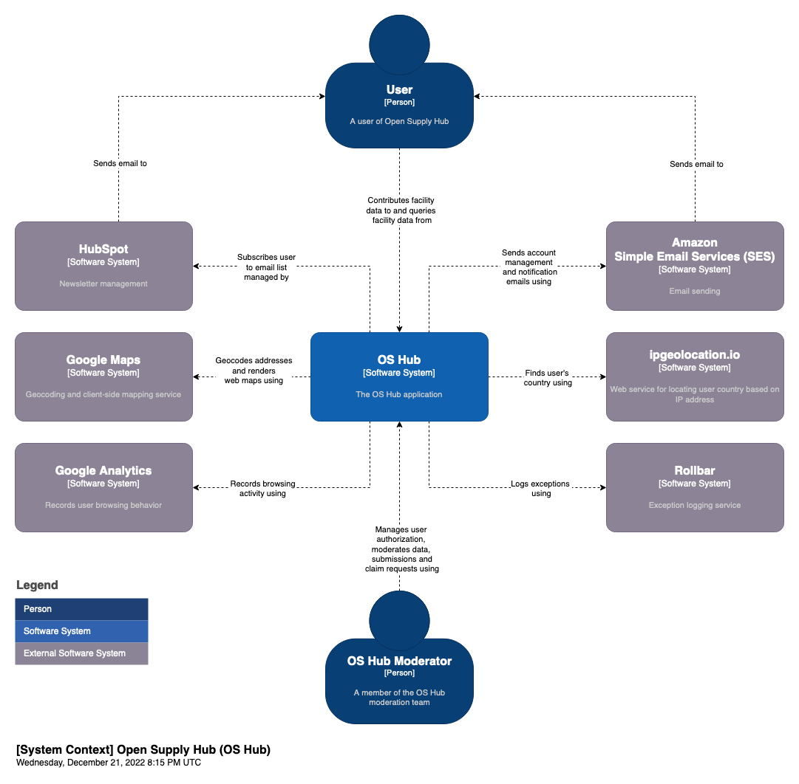
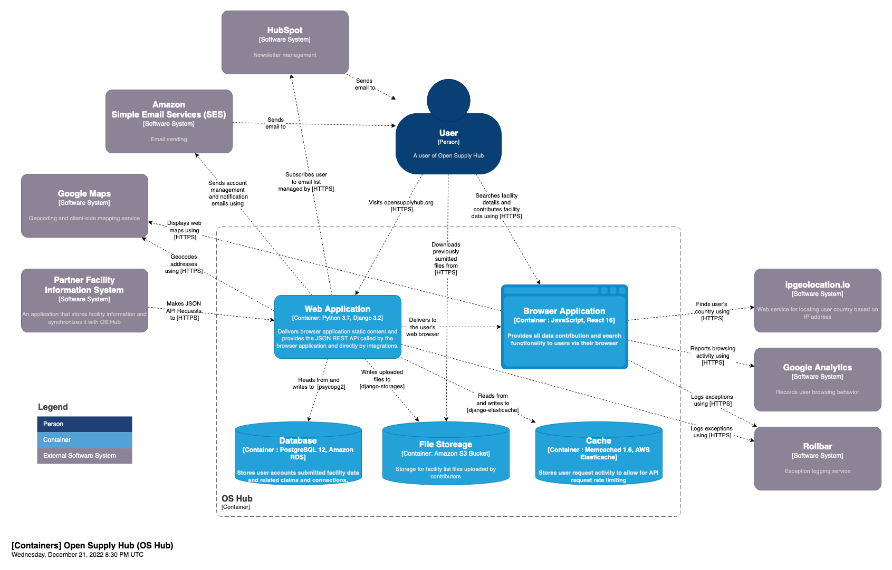
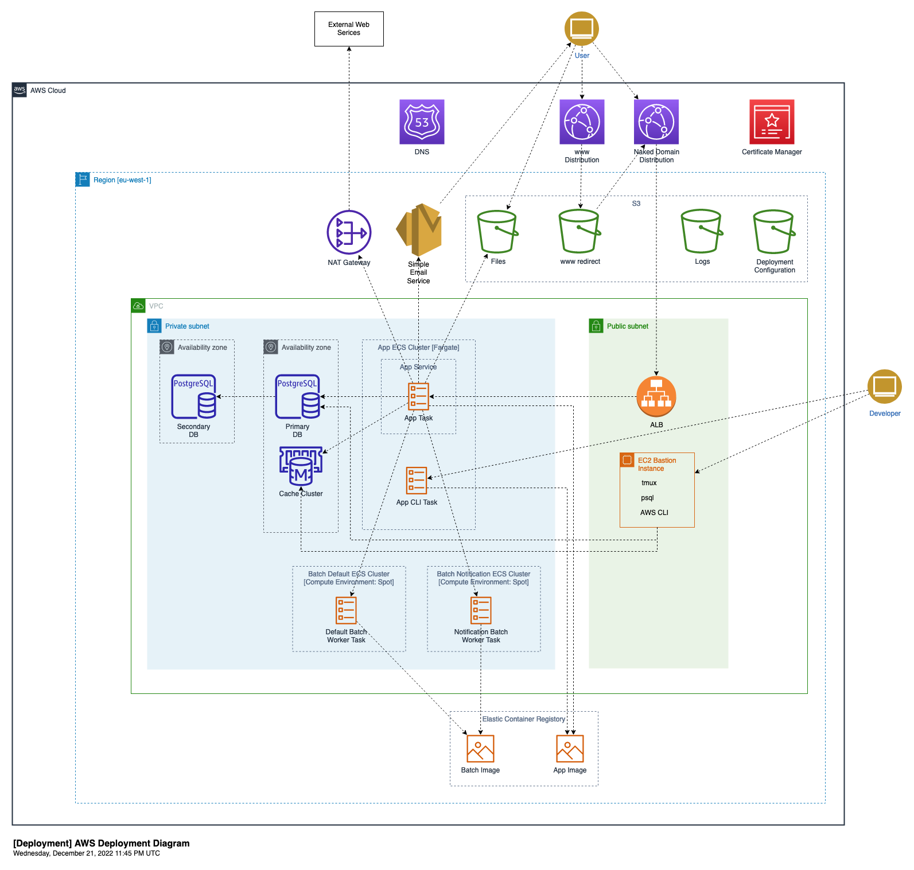

# Diagrams

Created using https://app.diagrams.net/

System context and container diagrams created using the [C4 model for
visualising software architecture](https://c4model.com/)

## System Context

[png](./System Context Diagram/OS Hub System Context Diagram.drawio.png)
[svg](./System Context Diagram/OS Hub System Context Diagram.drawio.svg)
[xml](./System Context Diagram/OS Hub System Context Diagram.drawio.xml)

## Container

[png](./Container Diagram/OS Hub Container Diagram.drawio.png)
[svg](./Container Diagram/OS Hub Container Diagram.drawio.svg)
[xml](./Container Diagram/OS Hub Container Diagram.drawio.xml)

## Deployment

[png](./Deployment Diagram/OS Hub Deployment Diagram.drawio.png)
[svg](./Deployment Diagram/OS Hub Deployment Diagram.drawio.svg)
[xml](./Deployment Diagram/OS Hub Deployment Diagram.drawio.xml)

