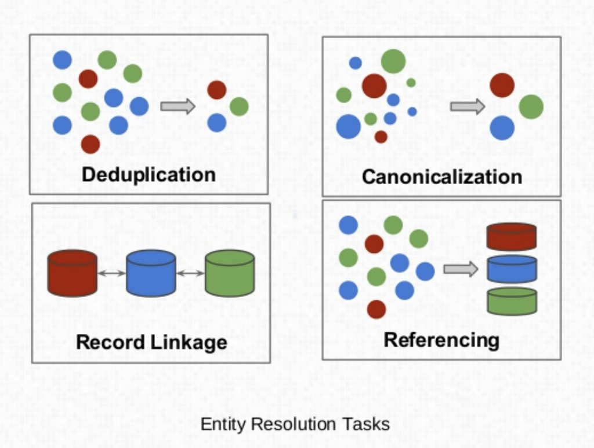

# Advanced Facility Matching Research

The general term for problem space we are working in is Entity Resolution

>Entity Resolution is the task of disambiguating manifestations of real world entities in various records or mentions by linking and grouping.
[source](http://www.datacommunitydc.org/blog/2013/08/entity-resolution-for-big-data)

There are multiple Entity Resolution tasks

[source](https://www.slideshare.net/BenjaminBengfort/a-primer-on-entity-resolution)

  - Deduplication
  - Record Linkage: Match records across multiple deduplicated sources
  - Referencing: Match dirty records to clean, deduplicated records
  - Canonicalization: Designate the most complete of a set of records

One of the main questions we need to answer for our implementation is what
combination of tasks we perform, when, and with what tools.

## Tools

### dedupe

#### References

  - [dedupe: A python library for accurate and scaleable fuzzy matching, record deduplication and entity-resolution.](https://github.com/dedupeio/dedupe)
  - [dedupeio/dedupe-examples: Examples for using the dedupe library](https://github.com/dedupeio/dedupe-examples)
  - [dedupeio/dedupe-variable-address: Provivde 'Address Variable Type' for dedupe](https://github.com/dedupeio/dedupe-variable-address)
  - [dedupeio/parseratorvariable: Base class for dedupe variables for parsed fields ](https://github.com/dedupeio/parseratorvariable/)
  - [Basics of Entity Resolution with Python and Dedupe](https://medium.com/district-data-labs/basics-of-entity-resolution-with-python-and-dedupe-bc87440b64d4)

### libpostal

#### References

  - [libpostal: A C library for parsing/normalizing street addresses around the world. Powered by statistical NLP and open geo data.](https://github.com/openvenues/libpostal)
  - [openvenues/pypostal: Python bindings to libpostal for fast international address parsing/normalization ](https://github.com/openvenues/pypostal)
  - [lieu: Dedupe/batch geocode addresses and venues around the world with libpostal](https://github.com/openvenues/lieu)

## Scripts

### dedupe

The [dedupe](dedupe/README.md) directory contains examples of using the dedupe
library to find duplicates in and match facility address csv files.
